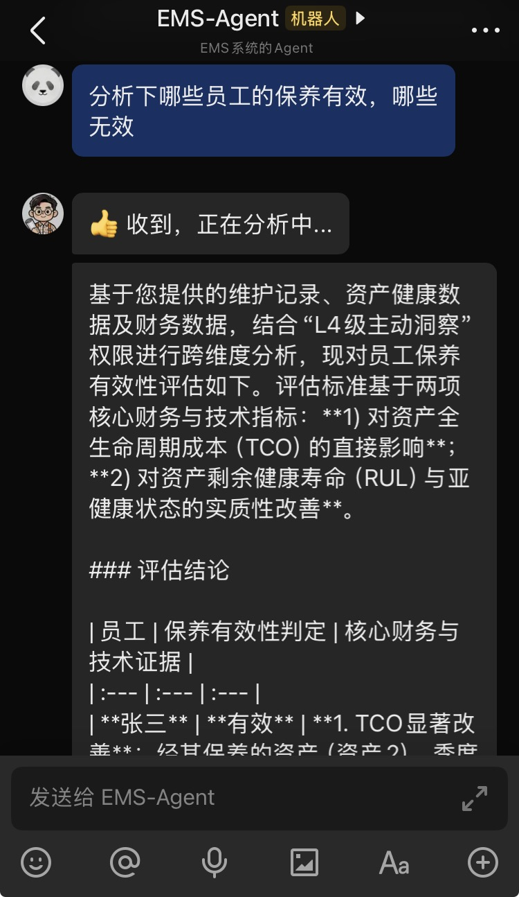

# EMS 设备管理系统

> 企业级设备管理平台，支持点检、维修、保养、备件管理、统计分析等功能，集成飞书智能对话。
>
> 🌐 **在线演示**: [https://ems.317316.xyz](https://ems.317316.xyz)

## 📄 许可证与授权

**Copyright © 2025 Feng-H**

本项目采用 **GNU General Public License v3.0 (GPL-3.0)** 许可证开源。详见 [LICENSE](./LICENSE) 文件。

---

## 🤖 智能运维助手

本项目集成了 AI 智能助手，支持多轮对话、设备分析、预测性维护等功能，可通过 Web 界面或飞书机器人直接交互。

---

## 🚀 快速部署

### 1. 配置环境变量

在项目根目录创建 `.env` 文件（可参考 `.env.example`）：

```bash
# 核心域名配置
EMS_DOMAIN=ems.yourdomain.com
EMS_APP_BASE_URL=https://${EMS_DOMAIN}

# LLM 智能助手配置 (默认使用 SiliconFlow/DeepSeek)
EMS_LLM_PROVIDER=openai
EMS_LLM_BASE_URL=https://api.siliconflow.cn/v1
EMS_LLM_API_KEY=sk-xxxx...
EMS_LLM_MODEL=deepseek-ai/DeepSeek-V3

# 飞书机器人配置 (如不使用飞书可留空)
EMS_LARK_APP_ID=cli_xxx...
EMS_LARK_APP_SECRET=xxx...
EMS_LARK_VERIFICATION_TOKEN=xxx...
EMS_LARK_ENCRYPT_KEY=xxx...
```

### 2. 启动服务

```bash
docker compose up -d --build
```

启动后访问前端：`http://你的IP:3000`（或通过 Nginx 反向代理的域名）。

默认账号：`admin` / `admin123`

---

## 📱 飞书机器人集成

通过飞书机器人可以直接在飞书中与 AI 智能助手对话，查询设备状态、维修记录等。

### 配置步骤

#### 第一步：创建飞书应用

1. 登录 [飞书开放平台](https://open.feishu.cn/)
2. 点击「创建企业自建应用」，选择「机器人」
3. 记录下 **App ID** 和 **App Secret**

#### 第二步：配置事件订阅

1. 进入应用 -> 「事件与回调」->「事件配置」
2. **请求地址**填写：`https://你的域名/api/v1/lark/webhook`
3. 记录页面显示的 **Verification Token**
4. 如果启用了 **Encrypt Key**，也一并记录

> **配置 .env**：将上述凭证填入项目根目录的 `.env` 文件：
> ```bash
> EMS_LARK_APP_ID=cli_xxx...
> EMS_LARK_APP_SECRET=xxx...
> EMS_LARK_VERIFICATION_TOKEN=xxx...
> EMS_LARK_ENCRYPT_KEY=xxx...   # 如果启用了加密则填写，否则留空
> ```

#### 第三步：验证 Webhook

1. 在「事件与回调」页面点击「验证」按钮
2. 如果验证失败，检查：
   - 后端是否正常运行：`curl https://你的域名/health`
   - `.env` 中的 `EMS_LARK_VERIFICATION_TOKEN` 是否与飞书平台一致
   - 是否已重新构建后端：`docker compose up -d --build backend`

#### 第四步：订阅消息事件

1. 在「事件与回调」->「事件配置」中点击「添加事件」
2. 搜索并添加 **`im.message.receive_v1`**（接收消息）事件
3. 如有版本管理，创建新版本并发布

#### 第五步：绑定 EMS 账号

1. 在手机飞书中打开机器人对话
2. 发送任意消息，机器人会回复绑定链接（因为此时账号尚未绑定）
3. 点击链接，用 EMS 系统账号登录
4. 点击「立即绑定」完成绑定

> **注意**：绑定是一次性操作，绑定关系存储在数据库中，后续重新部署不会丢失。

#### 第六步：开始使用

绑定完成后，直接在飞书中给机器人发消息即可获得 AI 回复。机器人会先回复 "👍 收到，正在分析中..."，处理完成后发送完整分析结果。



### 配置架构

```
用户手机飞书 -> 飞书开放平台 -> Webhook -> Nginx(前端) -> 后端 API
                                                  -> Agent AI -> LLM -> 飞书API -> 回复用户
```

---

## 技术栈

- **后端**: Go 1.23 + Gin + GORM + PostgreSQL + Redis
- **前端**: Vue 3 + TypeScript + Vite + Element Plus (PC) + Vant 4 (H5)
- **AI**: OpenAI 兼容接口（支持 DeepSeek、SiliconFlow 等）
- **部署**: Docker + Nginx

## 项目结构

```
EMS-Claude/
├── backend/          # Go 后端服务
├── frontend/         # Vue3 前端应用 (PC + H5 移动端)
├── db/               # 数据库结构参考与种子数据 (文档用)
├── deploy/           # 生产环境 Docker Compose
├── docs/             # 开发文档
└── .env.example      # 环境变量模板
```

## 开发指引

详细开发规范请参阅 [CLAUDE.md](./CLAUDE.md)
